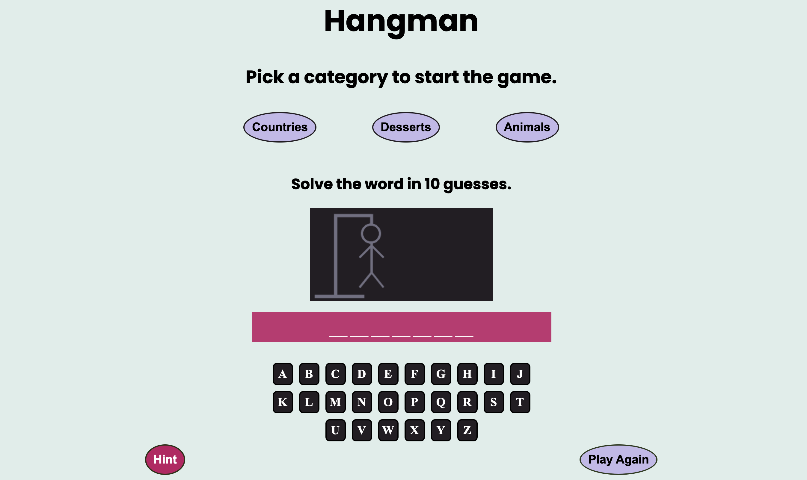
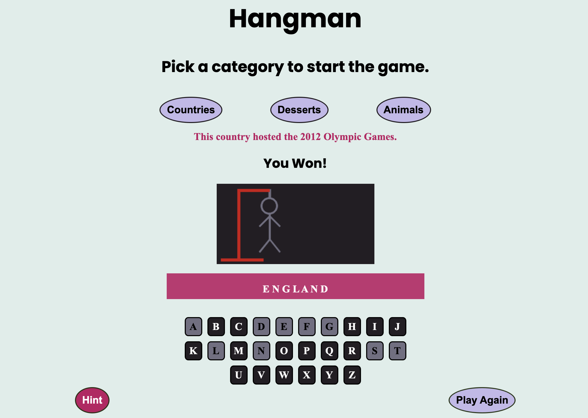
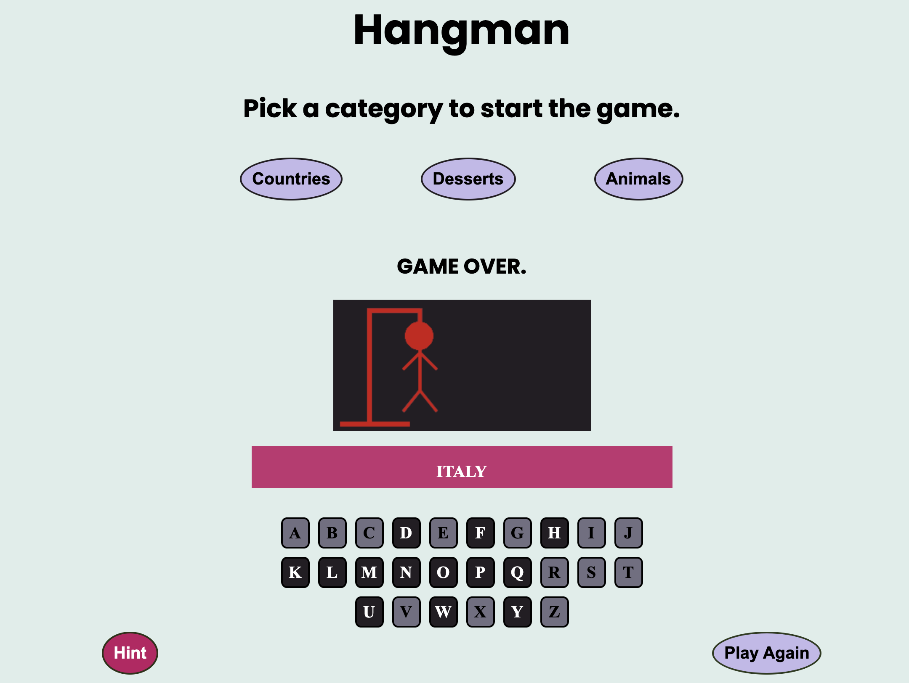

# My Hangman Game

Hangman is a word guessing game. To start the game chooses a category. Blank lines will appear that is the length of the unknown word. Click on any letter that you think might be in the unknown word. Once a letter has been clicked it will turn a light grey color indicateing it has been clicked.
If the letter that is guessed is in the unknown word it will replace one of the blank lines in the correct position of the word. If all of the correct letters are guessed you will receive a message saying 'You Won!'. For every incorrect guess the canvas will draw one part of the hangman image. If 10 incorrect letters are guessed a 'Game Over' message is displayed.
The hint button can be used to display a hint about the unknown word.
The play again button can be used to stat a new game.

## Screenshots

## Tech Stack

JavaScript, CSS, HTML.

## Deployment

To deploy this project.

https://samueljnel.github.io/My-Hangman-Game-/

## Next Steps

Add more categories for the user to choose from.
